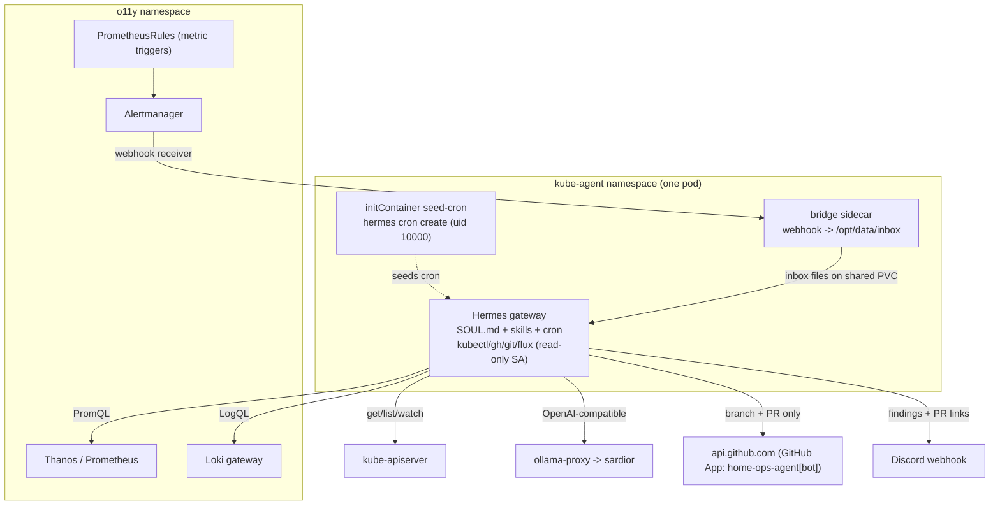

# kube-agent — Autonomous SRE Agent (Deployment Runbook)

A Hermes-based SRE agent for the homelab, ported from
[gke-labs/kube-agents](https://github.com/gke-labs/kube-agents) with the GKE
machinery stripped out. It watches the cluster (read-only), is triggered by
Alertmanager firings / Prometheus rules and a periodic scan loop, and proposes
fixes exclusively as **GitHub pull requests** — it never mutates live cluster
state and never pushes to `main`.

kube-agent lives in its own `kube-agent` namespace and fully replaces the
retired `zeroclaw` experiment.

## What was ported vs dropped

- **Kept:** the Hermes runtime (`nousresearch/hermes-agent`), the `SOUL.md`
  persona + `AGENTS.md` red-lines, `skills/`, and the Hermes cron watchdog
  scheduler; the "Automation First / GitOps-only mutations" doctrine.
- **Dropped (GKE-only):** the Go operator + `PlatformAgent` CRD, the gVisor
  RuntimeClass, the Envoy credential-proxy + Minty/KMS token minter, LiteLLM
  (Gemini/OpenAI), the GKE-managed OTel collector, and the Google Chat/Slack
  bridges. Local Ollama replaces the cloud LLM; a **GitHub App** replaces Minty;
  Discord replaces the chat bridges.

## Architecture



## Components

Under `kubernetes/apps/kube-agent/`:

| File | Purpose |
|------|---------|
| `namespace.yaml`, `kustomization.yaml` | New namespace (Flux auto-discovers the dir; no top-level registration needed). |
| `kube-agent/ks.yaml` | Flux Kustomization; `dependsOn` ollama-proxy; injects `cluster-secrets`. |
| `app/helmrelease.yaml` | bjw-s `app-template`: `seed-cron` initContainer + Hermes `app` container + Python `bridge` sidecar sharing the data PVC. Model points at `ollama-proxy`. |
| `app/home-configmap.yaml` | Hermes `config.yaml`, `SOUL.md`, `AGENTS.md`, and `seed-cron.sh` (idempotent `hermes cron create`). |
| `app/skills/{k8s-triage,github-pr}.yaml` | The triage and PR-authoring skills (single `SKILL.md` with frontmatter). |
| `app/bridge-configmap.yaml` | `adapter.py` — writes Alertmanager webhooks to `/opt/data/inbox`. |
| `app/rbac.yaml` | Read-only `kube-agent-investigator` ClusterRole + binding. |
| `app/pvc.yaml` | 5Gi iSCSI PVC for Hermes home (profiles, cron state, inbox, cloned repo). |
| `app/ciliumnetworkpolicy.yaml` | FQDN-scoped egress; ingress from Alertmanager only. |
| `app/prometheusrule.yaml` | Metric triggers (OOMKilled, ImagePull failures, restart rate). |
| `app/secret.sops.yaml` | GitHub App (`GITHUB_APP_ID` / `_INSTALLATION_ID` / `_PRIVATE_KEY` / `_BOT_EMAIL`) + `DISCORD_WEBHOOK_URL`. |
| `docker/kube-agent/Dockerfile` | Thin image: Hermes + kubectl/gh/git/flux/yq/openssl. |
| `docker/kube-agent/gh-app-token` | Mints a ~1h GitHub App installation token per run. |
| `.github/workflows/build-kube-agent-image.yaml` | Builds/pushes the image to GHCR. |

The Alertmanager receiver + route live in
`kubernetes/apps/o11y/kube-prometheus-stack/app/helmrelease.yaml` (a `kube-agent`
receiver with `continue: true` so Discord alerting is unaffected).

## Trigger model

1. **Alertmanager firings** → the `kube-agent` webhook receiver POSTs to the
   bridge sidecar, which writes each firing group to `/opt/data/inbox/`. The
   Hermes `Process Alertmanager Inbox` cron job (every 2m) drains it,
   investigates, and opens PRs.
2. **Prometheus metric triggers** → `prometheusrule.yaml` plus the many built-in
   kube-prometheus-stack rules become alerts that flow through the same path.
3. **Periodic sweep** → the `Cluster Error Sweep` cron job (every 30m) enumerates
   namespaces, finds bad pods / Warning events / failing Flux resources / error
   logs in Loki, cross-checks Alertmanager + Prometheus, and opens PRs.

The two cron jobs are **seeded by the `seed-cron` initContainer** via
`hermes cron create` (Hermes owns `cron/jobs.json`; direct edits are blocked by
`HERMES_WRITE_SAFE_ROOT=/opt/data`). Seeding is idempotent — existing jobs are
left untouched so Hermes keeps its own run state across restarts.

Why a shared-PVC inbox instead of pushing prompts into Hermes over HTTP: the
data PVC is `ReadWriteOnce`, so the bridge is co-located as a sidecar;
decoupling through the inbox avoids depending on a live HTTP prompt ingress.

## Design decisions (the four open questions)

**1. Observability / OTel — intentionally disabled.** The homelab has no OTLP
trace backend (no Tempo/Alloy/otel-collector; Grafana has no trace datasource),
and our thin image does not inherit upstream's `hermes_otel` plugin. `config.yaml`
carries no `telemetry`/`OTEL_*` config and the egress policy has no OTLP port —
so nothing is emitted and nothing is dropped. Visibility comes from the agent's
stdout (already shipped to Loki by Vector as `{namespace="kube-agent"}`) plus
kube-state-metrics for restarts. Re-enabling tracing later means deploying Tempo
+ a Vector OTLP source + baking the otel plugin into the image — out of scope.

**2. Sandboxing — no kernel sandbox; harden the real surface instead.** gVisor
would require rebuilding the Talos **secureboot schematic**, registering a CRI
handler, weakening a KSPP sysctl cluster-wide, and rolling-rebooting all three
nodes — to mitigate the *wrong* threat. In a single-operator cluster the real
risk is **prompt injection** (from alert text / pod logs) → GitHub-token exfil or
a malicious PR, which a kernel sandbox does not address. `kubernetes-sigs/agent-sandbox`
is young and provides no isolation itself (it just sets `runtimeClassName`).
Instead we invest in: FQDN-scoped egress (below), a short-lived App token, and a
hard human merge gate. Revisit gVisor only if the agent ever runs genuinely
untrusted third-party code.

**3. GitHub identity — GitHub App, not a PAT.** A PAT can't distinguish the agent
from the operator and muddies branch protection. The App `home-ops-agent` gives
an attributable `home-ops-agent[bot]` identity, least-privilege (Contents + PRs
only), short-lived (~1h) installation tokens minted per run, its own 5k/hr rate
pool, and clean revocation. Branch protection keeps the App **off the bypass
list**, so it physically cannot push to `main` or self-merge.

**4. Other homelab adaptations.** The image boots as **root by design** (its s6
entrypoint chowns `/opt/data` then drops to `hermes` uid 10000 — forcing
non-root breaks first-boot and root-gateway is refused unless via the
entrypoint); compensated by read-only RBAC, no Secret reads, and FQDN egress.
`gateway run --no-supervise` makes a gateway crash exit the pod so Kubernetes
restarts it. `context_length: 64000` is set because Hermes refuses <64k. Local
qwen is treated as *propose, never trust*: PRs open as **draft** behind the human
merge gate.

## Guardrails (defense in depth)

- **Read-only RBAC** (`kube-agent-investigator`): `get/list/watch` only, no
  Secret read, no write verbs.
- **PR-only doctrine** encoded in `SOUL.md` (always injected, incl. cron runs) +
  the `github-pr` skill: never `main`, never merge, one issue per PR (stable
  branch names + `gh pr list` dedup), never touch `*.sops.yaml`.
- **GitHub App**: scoped to this repo, Contents + Pull requests RW, ~1h tokens.
- **Human-in-the-loop**: PRs open as **draft**; a human reviews and merges.
- **Branch protection ruleset on `main`** (require PR + 1 approval, block direct
  push/force-push, empty bypass list) is the hard backstop.
- **FQDN egress lockdown**: only kube-apiserver, Ollama, o11y query surfaces,
  kube-dns, and HTTPS to `api.github.com` / `github.com` / `codeload.github.com`
  / `objects.githubusercontent.com` / `discord.com` / `*.duckduckgo.com`.

## Deployment steps

1. **Build the image first.** Merge `docker/kube-agent/**` to `main` (or run the
   `Build kube-agent Image` workflow via dispatch) so
   `ghcr.io/sp3nx0r/kube-agent-hermes:latest` exists, then make the GHCR package
   public (or grant the cluster pull access). The base tag is digest-pinned in
   the Dockerfile.
2. **Create the GitHub App** (`Settings → Developer settings → GitHub Apps`):
   - Name `home-ops-agent`; **uncheck** the webhook "Active" box; install on this
     account only.
   - Repository permissions: **Contents: Read and write**, **Pull requests: Read
     and write** (Metadata: read is implicit). Nothing else.
   - Generate a **private key** (`.pem`), note the **App ID**, install on
     `sp3nx0r/home-ops` only, and note the **Installation ID** (from the install
     URL `…/installations/<id>`).
   - Optionally capture the bot user id for the commit email:
     `gh api '/users/home-ops-agent[bot]' --jq .id`.
3. **Populate the secret** and re-encrypt:
   ```bash
   f=kubernetes/apps/kube-agent/kube-agent/app/secret.sops.yaml
   sops --decrypt "$f" > /tmp/ka.yaml
   # edit /tmp/ka.yaml: set GITHUB_APP_ID, GITHUB_APP_INSTALLATION_ID,
   #   GITHUB_APP_PRIVATE_KEY (full .pem), GITHUB_APP_BOT_EMAIL, DISCORD_WEBHOOK_URL
   cp /tmp/ka.yaml "$f" && sops --encrypt --in-place "$f" && rm /tmp/ka.yaml
   ```
4. **Add a `main` branch ruleset** (`Settings → Rules → Rulesets → New branch
   ruleset`): target the default branch, **bypass list empty**, require a PR +
   1 approval, require the `flux-local` status check, block force-push and
   deletion.
5. **Ensure the Ollama backend serves ≥64k context** for the configured model
   (`OLLAMA_CONTEXT_LENGTH=64000` / `num_ctx`); Hermes refuses to start below 64k
   and `/api/show` reports the model max, not the effective `num_ctx`.
6. **Reconcile Flux** and watch it come up:
   ```bash
   task reconcile
   kubectl -n kube-agent get pods
   kubectl -n kube-agent logs job/kube-agent -c seed-cron   # cron seeding
   kubectl -n kube-agent logs deploy/kube-agent -c app      # gateway
   ```

## Validation seams (verify against the running image)

Confirmed from Hermes docs, but validate on first boot:

- **Cron seeding** (highest priority): confirm the `seed-cron` initContainer's
  `hermes cron create` calls succeed as uid 10000 and that
  `kubectl -n kube-agent exec deploy/kube-agent -c app -- hermes cron list` shows
  both jobs. If seeding failed (e.g. the CLI needs a fuller config), seed
  manually with the same `hermes cron create` commands from `seed-cron.sh`.
- **Gateway startup**: `hermes gateway run --no-supervise` starts and the cron
  ticker fires; `context_length: 64000` is accepted by the backend.
- **Config expansion**: `api_key: $${OPENAI_API_KEY}` renders to
  `${OPENAI_API_KEY}` after Flux and Hermes expands it at runtime; the `custom`
  provider reaches `ollama-proxy:11435`.
- **GitHub App token**: `gh-app-token` mints a token and `gh auth setup-git`
  lets `git`/`gh` clone/push/PR as `home-ops-agent[bot]`.
- **FQDN egress**: Cilium's DNS proxy is enabled so the `toFQDNs` rules resolve;
  if the agent can't reach GitHub/Discord, check `hubble` for dropped DNS/FQDN.

## Follow-ups

- Consider a dedicated Discord channel/webhook so agent PRs are easy to triage.
- Optionally add the volsync component to back up `/opt/data` (reuse the shared
  Kopia password like other stateful apps).
- If local qwen produces low-quality diffs, wire a `fallback_providers` cloud
  model used only for the PR-authoring step (keep triage local).
- Once stable, move this doc to `docs/completed/`.
