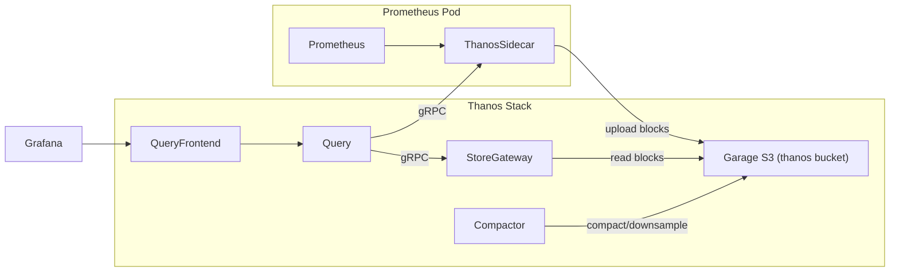

# Implement Thanos for Long-Term Metrics Storage

## Problem

Prometheus is backed by emptyDir -- a pod restart loses all metrics. There is no long-term storage or backup for time-series data.

## Solution

Add a Thanos sidecar to Prometheus that uploads TSDB blocks to Garage (S3), then deploy Thanos Query/Store Gateway/Compactor to serve historical data. Grafana will query through Thanos Query Frontend for seamless access to both recent and historical metrics.

## Architecture



**Data flow:**
- Prometheus scrapes metrics, retains 7d locally
- Thanos sidecar uploads 2h TSDB blocks to Garage as they close
- Store Gateway serves historical blocks from Garage on demand
- Compactor downsamples (5m at 30d, 1h at 90d) and deduplicates
- Query Frontend caches and splits large Grafana queries, routes to Query
- Query fans out to both sidecar (recent) and Store Gateway (historical)

## Chart Selection

**thanos-community/helm-charts** v0.18.0 (appVersion: Thanos v0.41.0)
- Helm repo: `https://thanos-community.github.io/helm-charts/`
- Single HelmRelease manages Query, Query Frontend, Store Gateway, Compactor
- Has kube-prometheus-stack as optional subchart (we'll disable it -- already deployed separately)
- Supports `global.objstore` with `createSecret: false` for externally-managed secrets
- Supports Gateway API HTTPRoute natively

## File Changes

### 1. Garage: Add `thanos` bucket and key

**File:** `kubernetes/apps/storage/garage/app/helmrelease.yaml`

Add to `clusterConfig.keys`:
```yaml
thanos:
  keyId: "${GARAGE_THANOS_KEY_ID}"
  secretKey: "${GARAGE_THANOS_SECRET_KEY}"
  buckets:
    - name: thanos
      read: true
      write: true
```

Add to `clusterConfig.buckets`:
```yaml
- name: thanos
  keys:
    - name: thanos
      permissions: ["read", "write"]
```

### 2. kube-prometheus-stack: Enable Thanos sidecar

**File:** `kubernetes/apps/o11y/kube-prometheus-stack/app/helmrelease.yaml`

Changes to `prometheus.prometheusSpec`:
```yaml
replicaExternalLabelName: __replica__
retention: 7d
retentionSize: 5GB
thanos:
  objectStorageConfig:
    existingSecret:
      name: thanos-objstore-secret
      key: objstore.yml
```

Add to `prometheus`:
```yaml
thanosService:
  enabled: true
thanosServiceMonitor:
  enabled: true
```

This enables the sidecar container inside the Prometheus pod and creates a `kube-prometheus-stack-thanos-discovery` Service for Thanos Query to find.

### 3. Thanos objstore secret (SOPS-encrypted)

**New file:** `kubernetes/apps/o11y/thanos/app/secret.sops.yaml`

Plaintext before encryption:
```yaml
apiVersion: v1
kind: Secret
metadata:
  name: thanos-objstore-secret
stringData:
  objstore.yml: |
    type: S3
    config:
      bucket: thanos
      endpoint: garage.storage.svc.cluster.local:3900
      access_key: <GARAGE_THANOS_KEY_ID value>
      secret_key: <GARAGE_THANOS_SECRET_KEY value>
      insecure: true
```

This same secret will be referenced by both kube-prometheus-stack (sidecar) and the Thanos chart. It needs to exist in `o11y` namespace. Since kube-prometheus-stack already lives there and mounts secrets from the same namespace, this works directly.

### 4. Thanos HelmRelease

**New directory:** `kubernetes/apps/o11y/thanos/app/`

**`helmrepository.yaml`:**
```yaml
apiVersion: source.toolkit.fluxcd.io/v1
kind: HelmRepository
metadata:
  name: thanos-community
spec:
  interval: 1h
  type: default
  url: https://thanos-community.github.io/helm-charts
```

**`helmrelease.yaml`** (key values):
```yaml
apiVersion: helm.toolkit.fluxcd.io/v2
kind: HelmRelease
metadata:
  name: thanos
spec:
  chart:
    spec:
      chart: thanos
      version: 0.18.0
      sourceRef:
        kind: HelmRepository
        name: thanos-community
  interval: 1h
  values:
    global:
      objstore:
        createSecret: false
        secretName: thanos-objstore-secret
        secretKey: objstore.yml

    kube-prometheus-stack:
      enabled: false

    query:
      enabled: true
      replicaCount: 1
      replicaLabels:
        - __replica__
      endpoints:
        autogen:
          enabled: true
        static:
          - dnssrv+_grpc._tcp.kube-prometheus-stack-thanos-discovery.o11y.svc.cluster.local
      httpRoute:
        enabled: true
        parentRefs:
          - name: envoy-internal
            namespace: network
        hostnames:
          - thanos.securimancy.com
      serviceMonitor:
        enabled: true

    queryFrontend:
      enabled: true
      replicaCount: 1
      serviceMonitor:
        enabled: true

    storegateway:
      enabled: true
      replicaCount: 1
      persistence:
        enabled: true
        size: 5Gi
        storageClass: iscsi
      serviceMonitor:
        enabled: true

    compactor:
      enabled: true
      replicaCount: 1
      persistence:
        enabled: true
        size: 10Gi
        storageClass: iscsi
      retention:
        resolutionRaw: 14d
        resolution5m: 30d
        resolution1h: 90d
      serviceMonitor:
        enabled: true

    # Disable unused components
    receive:
      enabled: false
    ruler:
      enabled: false
    bucket:
      enabled: false
```

### 5. Thanos `ks.yaml`

**New file:** `kubernetes/apps/o11y/thanos/ks.yaml`
```yaml
apiVersion: kustomize.toolkit.fluxcd.io/v1
kind: Kustomization
metadata:
  name: thanos
spec:
  interval: 1h
  path: ./kubernetes/apps/o11y/thanos/app
  prune: true
  sourceRef:
    kind: GitRepository
    name: flux-system
    namespace: flux-system
  targetNamespace: o11y
  wait: false
  dependsOn:
    - name: kube-prometheus-stack
  postBuild:
    substituteFrom:
      - kind: Secret
        name: cluster-secrets
```

### 6. Wire into namespace kustomization

**File:** `kubernetes/apps/o11y/kustomization.yaml`

Add:
```yaml
  - ./thanos/ks.yaml
```

### 7. Update Grafana datasource (single datasource)

Replace the existing Prometheus datasource URL in Grafana with Thanos Query Frontend (`http://thanos-query-frontend.o11y.svc.cluster.local:9090`). All dashboards and alerts continue to work unchanged -- Query Frontend fans out to the sidecar for recent data and Store Gateway for historical data, so the full time range is available through one endpoint. No second datasource needed.

### 8. cluster-secrets updates

Add the following variables to cluster-secrets (SOPS-encrypted):
- `GARAGE_THANOS_KEY_ID` -- S3 access key for the thanos bucket
- `GARAGE_THANOS_SECRET_KEY` -- S3 secret key for the thanos bucket

## Retention Summary

| Layer | Duration | Purpose |
|-------|----------|---------|
| Prometheus (local) | 7d / 5GB | Hot queries, real-time alerting |
| Object store (raw) | 14d | Full-resolution historical data |
| Object store (5m) | 30d | Medium-range dashboards |
| Object store (1h) | 90d | Long-range capacity planning |

## Considerations

- **Storage sizing**: At typical homelab cardinality (~50k active series), expect roughly 1-2 GB/month in Garage. The 50Gi Garage data volume should be more than sufficient for 90d retention.
- **emptyDir still used for Prometheus WAL**: The sidecar uploads completed blocks (every 2h). In a pod restart, you lose at most ~2h of metrics that haven't been uploaded yet. For full WAL persistence, a PVC would be needed (separate concern from this plan).
- **Garage single-node RF=1**: Object store data has no redundancy beyond what Garage provides. If the Garage iSCSI PVC is lost, historical metrics are gone. This is acceptable for a homelab but worth noting.
- **Secret sharing**: The `thanos-objstore-secret` lives in the `o11y` namespace and is referenced by both kube-prometheus-stack (for the sidecar) and the Thanos HelmRelease. Both are in the same namespace so this works.

## Failure Modes

| Scenario | Impact | Recovery |
|----------|--------|----------|
| Prometheus pod restart | Lose last ~2h (unuploaded block). Sidecar had already shipped older blocks to Garage. | Automatic -- Store Gateway serves historical data immediately. |
| Garage iSCSI read-only | Sidecar upload failures; Store Gateway reads still work for existing data. | Blocks queue in Prometheus until Garage is writable; gap fills on recovery. |
| Store Gateway PVC read-only | Can't update local index cache; existing cache still serves. | Restart after PVC recovers. |
| Thanos Query Frontend down | Grafana queries fail. | Stateless pod -- restarts in seconds. Alertmanager routes directly from Prometheus, unaffected. |

## References

- [thanos-community/helm-charts](https://github.com/thanos-community/helm-charts) -- chart source
- [bluevulpine/flux-talos](https://github.com/bluevulpine/flux-talos) -- Garage + Flux + Thanos sidecar reference
- [ishioni/homelab-ops](https://github.com/ishioni/homelab-ops) -- Flux + shared objstore secret pattern
- [Thanos storage docs](https://thanos.io/tip/thanos/storage.md/) -- objstore.yml schema reference
